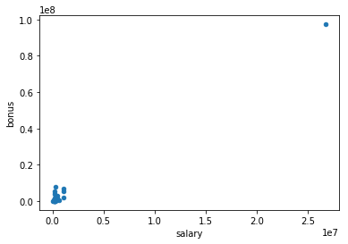
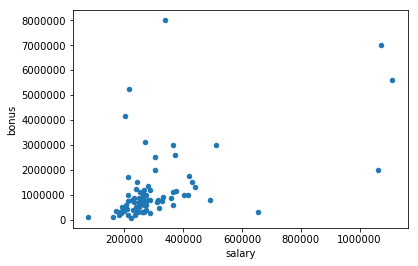

# Investigating the Enron Fraud with Machine Learning

## Project Overview

In 2000, Enron was one of the largest companies in the United States. By 2002, it had collapsed into bankruptcy due to widespread corporate fraud. In the resulting Federal investigation, a significant amount of typically confidential information entered into the public record, including tens of thousands of emails and detailed financial data for top executives. 

In this project, I will play detective and build a classification algorithm to predict a person of interest identifier (POI) based on email and financial features in the combined dataset. A POI is anyone who has been indicted, settled without admitting the guilt and testified in exchange for immunity. We will check our predicted POI against actual POI in the dataset to evaluate our prediction.

> Summarize for us the goal of this project and how machine learning is useful in trying to accomplish it. As part of your answer, give some background on the dataset and how it can be used to answer the project question. Were there any outliers in the data when you got it, and how did you handle those?

### Data Exploration

The required packages for data processing, visualization and model development are imported.


```python
import sys
import pickle
import numpy as np
import pandas as pd
%matplotlib inline
import matplotlib.pyplot as plt

sys.path.append("../tools/")

from feature_format import featureFormat, targetFeatureSplit
from tester import dump_classifier_and_data, test_classifier
from sklearn.cross_validation import train_test_split
from sklearn.preprocessing import StandardScaler
from sklearn.pipeline import Pipeline
from sklearn.svm import SVC
from sklearn.decomposition import PCA
from sklearn.feature_selection import SelectKBest
from sklearn.model_selection import GridSearchCV,StratifiedShuffleSplit
from sklearn.tree import DecisionTreeClassifier

### Load the dictionary containing the dataset
with open("final_project_dataset.pkl", "r") as data_file:
    data_dict = pickle.load(data_file)


# dict to dataframe
df = pd.DataFrame.from_dict(data_dict, orient='index')

df.replace('NaN', np.nan, inplace = True)
```


```python
df.info()
```

    <class 'pandas.core.frame.DataFrame'>
    Index: 146 entries, ALLEN PHILLIP K to YEAP SOON
    Data columns (total 21 columns):
    salary                       95 non-null float64
    to_messages                  86 non-null float64
    deferral_payments            39 non-null float64
    total_payments               125 non-null float64
    exercised_stock_options      102 non-null float64
    bonus                        82 non-null float64
    restricted_stock             110 non-null float64
    shared_receipt_with_poi      86 non-null float64
    restricted_stock_deferred    18 non-null float64
    total_stock_value            126 non-null float64
    expenses                     95 non-null float64
    loan_advances                4 non-null float64
    from_messages                86 non-null float64
    other                        93 non-null float64
    from_this_person_to_poi      86 non-null float64
    poi                          146 non-null bool
    director_fees                17 non-null float64
    deferred_income              49 non-null float64
    long_term_incentive          66 non-null float64
    email_address                111 non-null object
    from_poi_to_this_person      86 non-null float64
    dtypes: bool(1), float64(19), object(1)
    memory usage: 24.1+ KB


```python
df.shape
```


    (146, 21)


There are 146 observations and 21 variables in our dataset - 6 email features, 14 financial features and 1 POI label - and they are divided between 18 POI’s and 128 non-POI’s.

There are a lot of missing values, so, before the data is fed into the machine learning models they are going to be filled by zeros.


```python
print "There are {} POI and {} NON-POI in the dataset".format(df['poi'].value_counts()[True],
                                                              df['poi'].value_counts()[False])
```

    There are 18 POI and 128 NON-POI in the dataset


### Outlier Investigation


```python
df.plot.scatter(x = 'salary', y = 'bonus')
```


    <matplotlib.axes._subplots.AxesSubplot at 0x118c00410>





We found there is point with salary bigger than 2.5 *10^7, and it's very far from the other points. It shuold be the outlier, we need to remove this observations the next.

Who hold the max salary on the list employee of Enron?


```python
df['salary'].idxmax()
```


    'TOTAL'


```python
# remove the outlier 'TOTAL'
df.drop('TOTAL', inplace = True)

# plot again
df.plot.scatter(x = 'salary', y = 'bonus')
```


    <matplotlib.axes._subplots.AxesSubplot at 0x11878d0d0>





There seems be some point far from the main points, as it is enron data, we would keep them for analysis.

>What features did you end up using in your POI identifier, and what selection process did you use to pick them? Did you have to do any scaling? Why or why not? As part of the assignment, you should attempt to engineer your own feature that does not come ready-made in the dataset -- explain what feature you tried to make, and the rationale behind it. (You do not necessarily have to use it in the final analysis, only engineer and test it.) In your feature selection step, if you used an algorithm like a decision tree, please also give the feature importances of the features that you use, and if you used an automated feature selection function like SelectKBest, please report the feature scores and reasons for your choice of parameter values. 

### Scaling

I have used support vector classifier(SVC) on my final algorithm, therefore, I used preprocessing.StandardScaler to preprocess my input data by pipeline. I tried that it didn't work for my SVC algorithm if there is no data scaling while run test_classifier function of tester.py.

Actually the DAND cource explained scaling impacts to SVC and K-Means algorithm.

### Create new features

I add one features "bonus_salary_ratio" to the dataset, bonus salary ratio might be able to pick up on potential mischief involving employees with low salaries and high bonuses.The feature will as the input of my POI's classifiers.


```python
features_list = [
                 'poi',
                 'salary',
                 'deferral_payments',
                 'total_payments',
                 'loan_advances',
                 'bonus',
                 'bonus_salary_ratio',
                 'restricted_stock_deferred',
                 'deferred_income',
                 'total_stock_value',
                 'expenses',
                 'exercised_stock_options',
                 'other',
                 'long_term_incentive',
                 'restricted_stock',
                 'director_fees',
                 'to_messages',
                 'from_poi_to_this_person',
                 'from_messages',
                 'from_this_person_to_poi',
                 'shared_receipt_with_poi'
]

df["bonus_salary_ratio"] = df["bonus"].astype(float) / df["salary"].astype(float)
df["bonus_salary_ratio"].replace(np.nan, 0, inplace = True)
```

### Features selection

I used a univariate feature selection process, select k-best, in a pipeline with grid search to select the features. 

Select k-best removes all but the k highest scoring features. The number of features, 'k', was chosen through an exhaustive grid search driven by the 'precision' scoring estimator, intending to maximize precision and recall.

The order of features is descending based on feature score. the SelectKBest() selected all feature input

feature no.1 is exercised_stock_options,  score is [22.846900557]  
feature no.2 is total_stock_value,  score is [22.334566139]  
feature no.3 is salary,  score is [16.9609162406]  
feature no.4 is bonus,  score is [15.4914145509]  
feature no.5 is restricted_stock,  score is [8.61001146667]  
feature no.6 is total_payments,  score is [8.50623857494]  
feature no.7 is loan_advances,  score is [7.34999019799]  
feature no.8 is bonus_salary_ratio,  score is [7.10957852354]  
feature no.9 is shared_receipt_with_poi,  score is [7.06339857137]  
feature no.10 is deferred_income,  score is [6.19466529169]  
feature no.11 is long_term_incentive,  score is [5.66331492459]  
feature no.12 is expenses,  score is [5.28384552919]  
feature no.13 is from_poi_to_this_person,  score is [5.05036916285]  
feature no.14 is other,  score is [4.42180728832]  
feature no.15 is director_fees,  score is [1.76607492316]  
feature no.16 is to_messages,  score is [1.48694292495]  
feature no.17 is from_messages,  score is [0.811422991964]  
feature no.18 is deferral_payments,  score is [0.208737000969]  
feature no.19 is restricted_stock_deferred,  score is [0.0660617257379]  
feature no.20 is from_this_person_to_poi,  score is [0.00783222928418]  

>What algorithm did you end up using? What other one(s) did you try? How did model performance differ between algorithms?  [relevant rubric item: “pick an algorithm”] 

I end up using Support Vector Classifier (SVC) algorithm. I was focusing on two algorithms, they are

* Support Vector Classifier (SVC)
* Decision Tree Classifier

I used test_classifier of tester.py's evaluation metrics to test the algorithms, the classifiers could have at least 0.3 on precision and recall metrics, it returns the results as following. 


```python
results = {
"Algorithms":["Support vector classifier","Decision tree classifier"],
"Accuracy":[0.83120,0.85327],
"Precision":[0.36779,0.43853],
"Recall":[0.37000,0.35850],
"F1":[0.36889,0.39450],
"F2":[0.36956,0.37208]
}

algorithms = pd.DataFrame(results, columns = ["Algorithms","Accuracy", "Precision", "Recall", "F1", "F2"])
algorithms
```


<div>
<style>
    .dataframe thead tr:only-child th {
        text-align: right;
    }

    .dataframe thead th {
        text-align: left;
    }

    .dataframe tbody tr th {
        vertical-align: top;
    }
</style>
<table border="1" class="dataframe">
  <thead>
    <tr style="text-align: right;">
      <th></th>
      <th>Algorithms</th>
      <th>Accuracy</th>
      <th>Precision</th>
      <th>Recall</th>
      <th>F1</th>
      <th>F2</th>
    </tr>
  </thead>
  <tbody>
    <tr>
      <th>0</th>
      <td>Support vector classifier</td>
      <td>0.83120</td>
      <td>0.36779</td>
      <td>0.3700</td>
      <td>0.36889</td>
      <td>0.36956</td>
    </tr>
    <tr>
      <th>1</th>
      <td>Decision tree classifier</td>
      <td>0.85327</td>
      <td>0.43853</td>
      <td>0.3585</td>
      <td>0.39450</td>
      <td>0.37208</td>
    </tr>
  </tbody>
</table>
</div>


>What does it mean to tune the parameters of an algorithm, and what can happen if you don’t do this well?  How did you tune the parameters of your particular algorithm? What parameters did you tune? (Some algorithms do not have parameters that you need to tune -- if this is the case for the one you picked, identify and briefly explain how you would have done it for the model that was not your final choice or a different model that does utilize parameter tuning, e.g. a decision tree classifier).  [relevant rubric items: “discuss parameter tuning”, “tune the algorithm”]

Tuning the parameters of an algorithm means adjusting the parameters in a certain way to achieve optimal algorithm performance and evaluation metrics(e.g. precission and recall). I used GridSearchCV to do exhaustive search over different parameters and find the best parameters. 

I tuned for the parameters (C,class_weight,gamma and kernel) for SVC 

* 'svm__C': np.logspace(-2, 3, 6),
* 'svm__gamma': np.logspace(-4, 1, 6),
* 'svm__class_weight':['balanced', None],
* 'svm__kernel': ['rbf', 'sigmoid']

and this is the output tuned by GridSearchCV.

'C': 100.0,   
'class_weight': None,   
'gamma': 1.0,   
'kernel': 'sigmoid'   

>What is validation, and what’s a classic mistake you can make if you do it wrong? How did you validate your analysis?  [relevant rubric items: “discuss validation”, “validation strategy”]

Validation of a model is required to ensure that the model will perform consistently across various datasets/samples. In most practices, validation is performed by splitting data into training and testing sets, where neither set contains the same records. By doing this, the model's performance can be "validated" on the testing dataset, which it has not seen before. Validation helps ensure the model is not overfitted and only performs well on the trained dataset.

Each model will be scored using the test_classifier function from tester.py. This function returns the model's precision and recall. At a high level, a classifier's precision is its ability to correctly label POIs without having a lot of false positives. Recall measures how many POIs are identified by the model. It is important to measure both of these metrics, since certain algorithms could achieve high recall (by identifying close to all POIs), with lots of false positives (low precision), and vice versa.

In the test_classifier function, sklearn's StratifiedShuffleSplit module is used to create training and test sets. In the function, the classifier is fit to the training set, then predicted values are produced, scored and reported for the training set. This method is employed as it preserves a percentage of samples for each class. This is important since the POIs represent a small portion of the dataset.

>Give at least 2 evaluation metrics and your average performance for each of them.  Explain an interpretation of your metrics that says something human-understandable about your algorithm’s performance. [relevant rubric item: “usage of evaluation metrics”]


For classification algorithms, some of the most common evaluation metrics are accuracy, precision, recall and the f1 score.

* Accuracy shows the ratio between right classifications and the total number of predicted labels. Since the POI/non-POI distribution is very uneven, accuracy does not mean much. the models that predicts always non-POI’s would get an accuracy above 83%, which is an apparently good score for a terrible classifier.

* Precision is the ratio of right classifications over all observations with a given predicted label. For example, the ratio of true POI’s over all predicted POI’s.

* Recall is the ratio of right classifications over all observations that are truly of a given class. For example, the ratio of observations correctly labeled POI over all true POI’s.

* F1 is a way of balance precision and recall (2 * (precision * recall) / (precision + recall))


For the final selected model (i.e. SVC), the average scores were the following:   
**Accuracy 	Precision 	Recall 	F1 	        F2   **    
0.83120 	0.36779 	0.3700 	0.36889 	0.36956  


```python
#my_dataset = df.to_dict('index')

filled_df = df.fillna(value='NaN') # featureFormat expects 'NaN' strings
data_dict = filled_df.to_dict(orient='index')

### Store to my_dataset for easy export below.
my_dataset = data_dict

data = featureFormat(my_dataset,features_list)
labels, features = targetFeatureSplit(data)

#features_train, features_test, labels_train, labels_test = \
#    train_test_split(features, labels, test_size=0.3, random_state=42)

### Cross-validation
sss = StratifiedShuffleSplit(n_splits=10, test_size=0.2, random_state=42)
```

### Support Vector Classifier


```python
from sklearn import svm
estimators = [('scaler',StandardScaler()),
              ('feature_selection', SelectKBest()),
              ('reducer', PCA(random_state=42)),
              ('svm',svm.SVC())]
pipe = Pipeline(estimators)
param_grid = ([{'feature_selection__k':[10, 13, 15, 'all'],
                'reducer__n_components':[2, 4, 6, 8, 10],
                'svm__C': np.logspace(-2, 3, 6),
                'svm__gamma': np.logspace(-4, 1, 6),
                'svm__class_weight':['balanced', None],
                'svm__kernel': ['rbf', 'sigmoid']}])

grid_search = GridSearchCV(pipe, param_grid, scoring='precision', cv=sss)
grid_search.fit(features, labels)
#labels_predictions = grid_search.predict(features_test)

clf = grid_search.best_estimator_
print "\n", "Best parameters are: ", grid_search.best_params_, "\n"

test_classifier(clf, my_dataset, features_list)
```

    
    Best parameters are:  {'reducer__n_components': 6, 'svm__C': 100.0, 'svm__class_weight': None, 'svm__gamma': 1.0, 'feature_selection__k': 'all', 'svm__kernel': 'sigmoid'} 
    
    Pipeline(steps=[('scaler', StandardScaler(copy=True, with_mean=True, with_std=True)), ('feature_selection', SelectKBest(k='all', score_func=<function f_classif at 0x114e0d758>)), ('reducer', PCA(copy=True, iterated_power='auto', n_components=6, random_state=42,
      svd_solver='auto', tol=0.0, whiten=False)), (...,
      max_iter=-1, probability=False, random_state=None, shrinking=True,
      tol=0.001, verbose=False))])
    	Accuracy: 0.83120	Precision: 0.36779	Recall: 0.37000	F1: 0.36889	F2: 0.36956
    	Total predictions: 15000	True positives:  740	False positives: 1272	False negatives: 1260	True negatives: 11728
    


### Feature selected and importances


```python
# Print features selected and their scores
kbest = grid_search.best_estimator_.named_steps['feature_selection']

features_array = np.array(features_list)
features_array = np.delete(features_array, 0)
indices = np.argsort(kbest.scores_)[::-1]

feature_selected = []
feature_scores = []
for i in range(len(kbest.get_support(indices=True))):
    feature_selected.append(features_array[indices[i]])
    feature_scores.append(kbest.scores_[indices[i]])
    print "feature no.{} is {},  score is [{}]".format(i+1, features_array[indices[i]],kbest.scores_[indices[i]])
```

    feature no.1 is exercised_stock_options,  score is [22.846900557]
    feature no.2 is total_stock_value,  score is [22.334566139]
    feature no.3 is salary,  score is [16.9609162406]
    feature no.4 is bonus,  score is [15.4914145509]
    feature no.5 is restricted_stock,  score is [8.61001146667]
    feature no.6 is total_payments,  score is [8.50623857494]
    feature no.7 is loan_advances,  score is [7.34999019799]
    feature no.8 is bonus_salary_ratio,  score is [7.10957852354]
    feature no.9 is shared_receipt_with_poi,  score is [7.06339857137]
    feature no.10 is deferred_income,  score is [6.19466529169]
    feature no.11 is long_term_incentive,  score is [5.66331492459]
    feature no.12 is expenses,  score is [5.28384552919]
    feature no.13 is from_poi_to_this_person,  score is [5.05036916285]
    feature no.14 is other,  score is [4.42180728832]
    feature no.15 is director_fees,  score is [1.76607492316]
    feature no.16 is to_messages,  score is [1.48694292495]
    feature no.17 is from_messages,  score is [0.811422991964]
    feature no.18 is deferral_payments,  score is [0.208737000969]
    feature no.19 is restricted_stock_deferred,  score is [0.0660617257379]
    feature no.20 is from_this_person_to_poi,  score is [0.00783222928418]


### Decision Tree Classifier


```python
estimators = [('scaler',StandardScaler()),
              ('feature_selection', SelectKBest()),
              ('reducer', PCA(random_state=42)),
              ('clf', DecisionTreeClassifier())]
pipe = Pipeline(estimators)

param_grid = dict(feature_selection__k=[10, 13, 15, 'all'],
                  reducer__n_components=[2, 4, 6, 8, 10],
                  clf__min_samples_split=[2,4,10,20],
                  clf__criterion=['gini', 'entropy'],
                  clf__max_depth=[None, 1, 2, 3, 4],
                  clf__class_weight=[None, 'balanced']
                 )
grid_search = GridSearchCV(pipe, param_grid=param_grid,scoring='f1', cv=sss)

grid_search.fit(features, labels)
labels_predictions = grid_search.predict(features_test)

# Pick the classifier with the best tuned parameters
clf = grid_search.best_estimator_
print "\n", "Best parameters are: ", grid_search.best_params_, "\n"

test_classifier(clf, my_dataset, features_list)
```

    
    Best parameters are:  {'reducer__n_components': 2, 'clf__criterion': 'gini', 'clf__max_depth': None, 'feature_selection__k': 'all', 'clf__class_weight': None, 'clf__min_samples_split': 10} 
    
    Pipeline(steps=[('scaler', StandardScaler(copy=True, with_mean=True, with_std=True)), ('feature_selection', SelectKBest(k='all', score_func=<function f_classif at 0x114e0d758>)), ('reducer', PCA(copy=True, iterated_power='auto', n_components=2, random_state=42,
      svd_solver='auto', tol=0.0, whiten=False)), (...t=10, min_weight_fraction_leaf=0.0,
                presort=False, random_state=None, splitter='best'))])
    	Accuracy: 0.85373	Precision: 0.44027	Recall: 0.35750	F1: 0.39459	F2: 0.37147
    	Total predictions: 15000	True positives:  715	False positives:  909	False negatives: 1285	True negatives: 12091
    


## Reference
https://classroom.udacity.com/nanodegrees/nd002-cn-advanced/parts/7f46cd58-8041-4d9d-88a5-4b7c6f7be63e  
http://scikit-learn.org/stable/modules/pipeline.html  
http://scikit-learn.org/stable/auto_examples/plot_compare_reduction.html#sphx-glr-auto-examples-plot-compare-reduction-py  
http://scikit-learn.org/stable/modules/generated/sklearn.model_selection.GridSearchCV.html#sklearn.model_selection.GridSearchCV  


```python

```


```python

```
